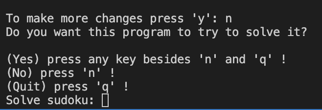

# Welcome to Sudoku Solver
## Purpose 
The purpose of the sudoku solver is to be a usefull tool to help solve sudoku puzzles. I personally find this tool usefull because I like solving the sudoku puzzles. So I created this project for personal use in times of need.

## Input

The main input of this program is the sudoku itself.
Sudoku traditionally of 9x9 dimentions and divided in 9 squeres of 3x3 dimentions. Each 3x3 square (quadrant), row and column can have only unique values in range from 1 till 9.
This program takes only this kind of sudoku for solving.

## Testing with different kinds of inputs for sudoku:

### Sudoku input is too short

After entering an input that is too short:
* shows message that the input is not 81 characters long
* let's make the input for sudoku again

 - CORRECT response to the situation

### Sudoku input is too long

After entering an input that is too long:
* shows message that the input is not 81 characters long
* let's make the input for sudoku again

 - CORRECT response to the situation

### Sudoku input doesn't have enough integers for solving it.

After enetring an input of 81 charachters and with less than 17 integers:
* shows a message that the input didn't have enough integer values (filled in values)
* let's you make the input of sudoku again
 - CORRECT response

### Enter pressed without entering a sudoku

If enter is pressed without inputing a string:
* shows a message that no sudoku was input
* quits program
 - CORRECT response to the situation

### Error in input

If sudoku is entered with already existing error in it - the same value is filled in in the same row column or quadrant.
* takes it as a valid input for now
* asks if user wants to change any cell that was entered
 - CORRECT response
 - In the future sudoku solver could be updated to catch this as an error but because of the constraints it was left as an feature to add later not as an error of the program.

## Testing with different kinds of inputs for modifying the input sudoku:

### Cell value change after sudoku input

If entered 'y' to change a cell value:
* a map is displayed to help name the field to change the value of
* let's make an input for the cell code XX
  * if entered a correct code - shows current value
  * if entered an incorrect code - shows map agai to enter the code for the cell again

 - CORRECT response to the situation

### Cell value change after sudoku input

If entered 'y' to change a cell value:
* a map is displayed to help name the field to change the value of
* let's make an input for the cell code XX
  * if entered a correct code - shows current value
  * if entered an incorrect code - shows map again to enter the code for the cell again

 - CORRECT response to the situation

* when testing on deployed version on Heroku a bug that doesn't appear in console appeared. When changing the values of seperate cells is done - The matrix loses a couple of fields and and the matrix is displayed wrong.

### Offers to solve sudoku

If the sudoku input was succesfull and user has finished making changes to the cells if user wished to make any:
* offers to solve sudoku if user wishes to solve it
* based on next input:
  * continues to solve
  * offers to hint a cell if 'n' 
  * quits program if 'q'

 - CORRECT response to the situation

### If solver cannot solve the sudoku

If the sudoku solver couln't reach a solved sudoku:
* offers to hint cells of the sudoku if user wishes to get a hint from the solver
* based on next input:
  * asks for a cell code to deliver a hint for
  * shows what the unsolved sudoku was and offers to solve another sudoku if 'n'
  * shows what the unsolved sudoku was and quits program if 'q'

 - CORRECT response to the situation

### If solver can solve the sudoku

If the sudoku solver could reach a solved sudoku:
* it prints out the process of filling each cell out and the sudoku after each new filled cell. In the end it mention that the user can see the steps by scrolling back
* offers to solve another

 - CORRECT response to the situation

## Deployment

The program was deployed using Heroku after being developed in GitHub using GitPod development enviroment.
I was making commits to GitHub to document the progres of the development and later I followed the 2 video instuctions when deploying on Heroku.
I started by creating a profile on Heroku platform and the created the app for this program.
In the settings section for my app (on Heroku) I added two buildpacks (`heroku/python`, `heroku/nodejs`) and created a configurations variable called `PORT`. Set this to `8000`.
And the I manually deployed the program.
I found at least one bug in the deployed version that I haven't fixed yet (when replacing a value of a sudoku cell the matrix loses it's shape. But I couldn't find the reason for it and it does not appear in the console version of the program in GitPod) 

## Edits for resubmission 

The issues that needed solving for resubmission were that:
* code does not comply with PEP8 conventions

### PEP8
* cell_relatives tuple
The issue was solved by moving the last value in the inner tuples to the next row but leaving the rest of the tuple unchanged so it doesn't lose it's clear structure on sight.

* if statement
The condition was put in parenthesis and split in two rows.

* comments
Some lines in comments needed to be split in tWo rows.

* string values too long for one line
Reference: https://stackoverflow.com/questions/1874592/how-to-write-very-long-string-that-conforms-with-pep8-and-prevent-e501

* warnings about strings that have no effect
The strings are comments on the following code pieces so they were not changed since they are supposed to be only informative to the person looking at the code.

## Credits

* w3schools information on data types and methods
* Mentor suggestions
* CI lessons
* stackoverflow for more concrete solutions (references in the code)
* other materials on the processes (reference in the code)

## Conclusion 
I generally like solving sudoku puzzles and I can do it in quick leisurely pace without a problem. So I chose this as my project idea.
But during the development of the program it became clear that the coding solution isn't as simple as I thought. I lost a lot of time trying to make the initially very complicated logic work right and had to redo entire sections of the code because I hit a 'swamp' of if statemnets and for loops so deep I couln't make sense of it anymore. I retrospect I should have probably chosen a simpler thing to code. Bu in general I am happy with the result. Putting aside a lot of 'what if this gets entered there' The program can solve a sudoku.